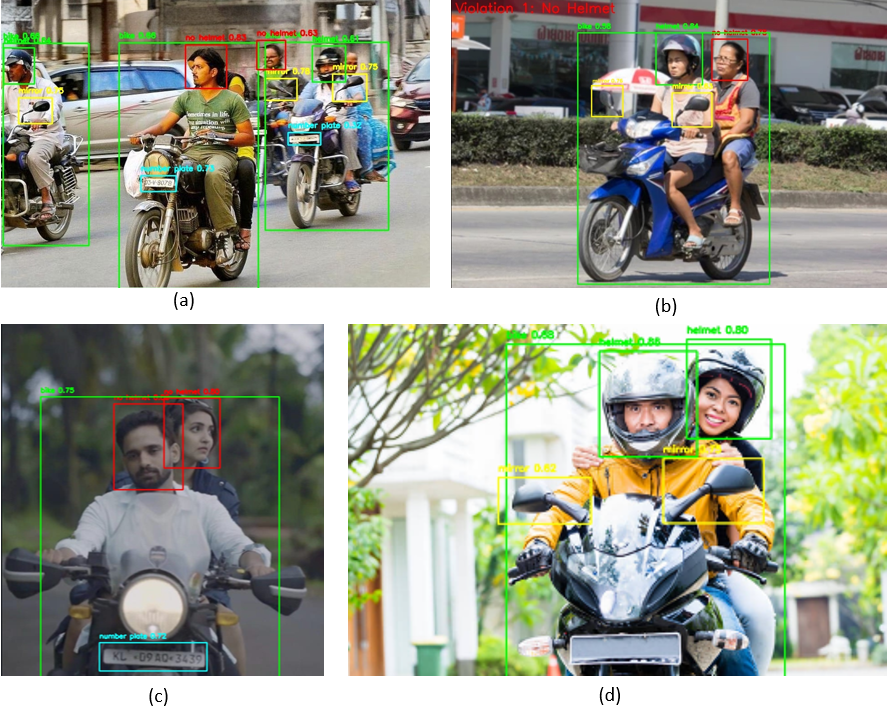

# 🚦 AI-Driven System for Real-Time Detection of Mirror Absence, Helmet Non-Compliance, and License Plates Using YOLOv8 and OCR

A comprehensive computer vision system for research and academic purposes that detects traffic violations using YOLOv8, including helmet detection, license plate recognition (LPR), and mirror detection for motorcycles and bikes.

## ✨ Features

- **🏍️ Helmet Detection**: Automatically detects riders with and without helmets
- **📝 License Plate Recognition**: OCR-based license plate reading with enhanced preprocessing
- **🪞 Mirror Detection**: Identifies motorcycles with missing mirrors
- **🚗 Vehicle Classification**: Distinguishes between bikes and motorcycles
- **📊 Real-time Processing**: Supports both image and video analysis
- **🎯 Violation Tracking**: Logs and tracks traffic violations with timestamps
- **🖥️ Web Interface**: User-friendly Streamlit application
- **⚡ Optimized Performance**: Multi-threading support for video processing

## 🎯 Project Overview

This system uses a custom-trained YOLOv8 model to detect 5 different classes:
- **bike**: Motorcycles and bikes
- **helmet**: Riders wearing helmets
- **mirror**: Vehicle mirrors
- **no helmet**: Riders without helmets (traffic violation)
- **number plate**: License plates

The system combines object detection with OCR (Optical Character Recognition) to provide comprehensive traffic violation monitoring capabilities for research and academic studies.

## 📁 Repository Structure

```
YOLOv8-Helmet-Mirror-LPR-Detection/
├── 📄 README.md                           # Project documentation
├── 🐍 app.py                              # Streamlit web application
├── 🐍 main.py                             # Main detection module
├── 🤖 yolov8-model.pt                     # Pre-trained YOLOv8 model (50MB)
├── 📊 log.png                             # Training performance logs
├── 🖼️ output.png                          # Sample detection results
├── 📁 dataset/                            # Training and validation dataset
│   ├── 📄 data.yaml                       # Dataset configuration file
│   ├── 📄 README.dataset.txt              # Dataset information
│   ├── 📄 README.roboflow.txt             # Roboflow dataset details
│   ├── 📁 train/                          # Training data
│   │   ├── 📁 images/                     # Training images
│   │   └── 📁 labels/                     # Training annotations (YOLO format)
│   ├── 📁 valid/                          # Validation data
│   │   ├── 📁 images/                     # Validation images
│   │   └── 📁 labels/                     # Validation annotations
│   └── 📁 test/                           # Test data
│       ├── 📁 images/                     # Test images
│       └── 📁 labels/                     # Test annotations
└── 📁 .git/                               # Git version control
```

### File Descriptions

| File | Description | Size |
|------|-------------|------|
| `app.py` | Streamlit web interface for easy interaction | 10KB |
| `main.py` | Core detection and processing logic | 15KB |
| `yolov8-model.pt` | Pre-trained YOLOv8 model weights | 50MB |
| `log.png` | Training performance visualization | 73KB |
| `output.png` | Sample detection results | 1.1MB |
| `data.yaml` | Dataset configuration for YOLO training | 326B |

## 🚀 Installation

### Prerequisites

- Python 3.8 or higher
- CUDA-compatible GPU (optional, for faster processing)
- 4GB+ RAM recommended

### Step 1: Clone the Repository

```bash
git clone https://github.com/yourusername/YOLOv8-Helmet-Mirror-LPR-Detection.git
cd YOLOv8-Helmet-Mirror-LPR-Detection
```

### Step 2: Install Dependencies

```bash
pip install ultralytics opencv-python easyocr streamlit pillow torch torchvision
```

### Step 3: Verify Installation

The pre-trained model (`yolov8-model.pt`) is included in the repository. No additional downloads required.

## 💻 Usage

### Web Application (Recommended)

1. **Start the Streamlit app**:
   ```bash
   streamlit run app.py
   ```

2. **Open your browser** and navigate to the displayed URL (usually `http://localhost:8501`)

3. **Upload files**:
   - Upload the YOLO model file (`yolov8-model.pt`)
   - Upload an image or video file for analysis

4. **Configure settings** (optional):
   - Adjust confidence threshold
   - Enable/disable specific detection features

5. **View results**:
   - Detection results with bounding boxes
   - Violation logs with timestamps
   - License plate text extraction

### Command Line Usage

```python
from main import YOLODetector

# Initialize detector
detector = YOLODetector('yolov8-model.pt', conf_threshold=0.25)

# Process image
results = detector.process_image('path/to/image.jpg')

# Process video
detector.process_video_optimized('path/to/video.mp4')
```

## 🤖 Model Details

### Architecture
- **Base Model**: YOLOv8 (Ultralytics)
- **Input Resolution**: Configurable (default optimized for 640x640)
- **Classes**: 5 (bike, helmet, mirror, no helmet, number plate)
- **Training Dataset**: Custom dataset with 1000+ annotated images

### Performance Metrics
- **mAP@0.5**: 0.843
- **Precision**: 0.9147
- **Recall**: 0.886
- **mAP@0.5-0.95**: 0.503

### Model Training

To retrain the model with your own data:

1. **Prepare dataset** in YOLO format
2. **Update `dataset/data.yaml`** with your paths
3. **Train the model**:
   ```bash
   yolo train data=dataset/data.yaml model=yolov8n.pt epochs=100 imgsz=640
   ```

### Dataset Structure
```
dataset/
├── train/
│   ├── images/          # Training images
│   └── labels/          # Training annotations (YOLO format)
├── valid/
│   ├── images/          # Validation images
│   └── labels/          # Validation annotations
├── test/
│   ├── images/          # Test images
│   └── labels/          # Test annotations
└── data.yaml            # Dataset configuration
```

### Annotation Format
Labels are in YOLO format with 5 classes:
- 0: bike
- 1: helmet
- 2: mirror
- 3: no helmet
- 4: number plate

#### Constructor
```python
YOLODetector(model_path, conf_threshold=0.25)
```

#### Methods

- `process_image(image_path)`: Process single image
- `process_video_optimized(video_path, display=True, progress_callback=None)`: Process video with optimization
- `read_license_plate(frame, bbox)`: Extract license plate text
- `find_nearest_plate(no_helmet_bbox, plate_bboxes, max_distance=150)`: Match riders to license plates

### Configuration Parameters

- `conf_threshold`: Detection confidence threshold (0.0-1.0)
- `max_distance`: Maximum distance for plate-rider matching (pixels)
- `gpu_enabled`: Enable/disable GPU acceleration

## 🔬 Research Applications

This project is designed for research and academic purposes in the following areas:

### Computer Vision Research
- **Object Detection**: YOLOv8 implementation and optimization
- **Multi-class Detection**: Simultaneous detection of multiple traffic elements
- **Real-time Processing**: Performance optimization for live video streams

### Traffic Safety Research
- **Helmet Compliance Studies**: Analysis of helmet usage patterns
- **Traffic Violation Analysis**: Automated detection and logging
- **Safety Equipment Monitoring**: Mirror and safety gear detection

### OCR and Text Recognition
- **License Plate Recognition**: Enhanced preprocessing techniques
- **Text Extraction**: Real-time OCR from video streams
- **Character Recognition**: Improved accuracy in challenging conditions

### Academic Applications
- **Machine Learning Courses**: Practical implementation of YOLO models
- **Computer Vision Projects**: Complete pipeline from data to deployment
- **Research Publications**: Foundation for traffic safety studies

## 🎨 Sample Results

### Detection Examples


### Training Performance


## 🤝 Contributing

We welcome contributions from researchers and academics! Please follow these guidelines:

1. Fork the repository
2. Create a feature branch (`git checkout -b feature/ResearchFeature`)
3. Commit your changes (`git commit -m 'Add research enhancement'`)
4. Push to the branch (`git push origin feature/ResearchFeature`)
5. Open a Pull Request

### Research Contributions
- **Dataset Improvements**: Enhanced annotations or additional data
- **Model Optimizations**: Better performance or efficiency
- **Feature Extensions**: New detection capabilities
- **Documentation**: Improved academic documentation

### Development Setup

```bash
# Install development dependencies
pip install -r requirements-dev.txt

# Run tests
python -m pytest tests/

# Format code
black .
```

## 📝 License

### Academic and Research License

This project is licensed under the **Academic and Research License** for educational and research purposes only.

**Terms of Use:**
- ✅ **Permitted**: Academic research, educational use, non-commercial studies
- ✅ **Permitted**: Publication of research results using this system
- ✅ **Permitted**: Modification and extension for research purposes
- ❌ **Not Permitted**: Commercial use, production deployment, commercial distribution
- ❌ **Not Permitted**: Use in surveillance systems without proper authorization

**Citation:**
If you use this project in your research, please cite:
```bibtex
@software{yolov8_traffic_detection,
  title={YOLOv8 Traffic Violation Detection System},
  author={Your Name},
  year={2024},
  url={https://github.com/yourusername/YOLOv8-Helmet-Mirror-LPR-Detection}
}
```

**Disclaimer:**
This system is designed for research and academic purposes only. Users are responsible for ensuring compliance with local privacy laws, surveillance regulations, and ethical guidelines when using this system. The authors are not responsible for any misuse or unauthorized deployment.

## 📞 Support

For research questions, academic collaboration, or technical support:
- Create an issue on GitHub
- Contact: hegde.nishant2005@gmail.com
---

**⚠️ Important Notice**: This system is designed exclusively for research and academic purposes. Please ensure compliance with institutional review board (IRB) requirements, privacy laws, and ethical guidelines when conducting research with this system. 
